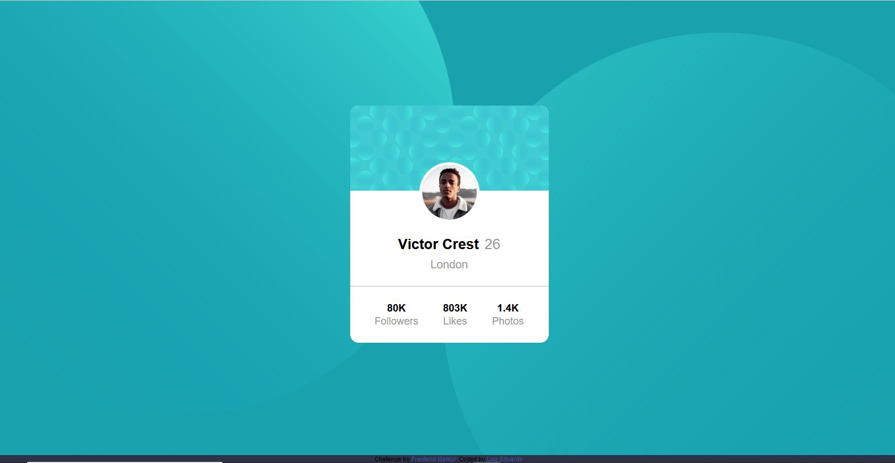

# Treinamento - Profile card component solution - Dia 1

Este mini-projeto, faz parte do meu treinamento para aprender os fundamentos para ser desenvolvedor Front-end. Para realizar esse treinamento, estou utilizando os desafios disponibilizados no [Front-end Mentor](https://www.frontendmentor.io/).

## Sumário

- [Visão Geral](#resumo)
  - [O desafio](#o-desafio)
  - [Screenshot](#screenshot)
  - [Links](#links)
- [Processo de criação](#processo-de-crição)
  - [O que foi usado?](#o-que-foi-usado?)
  - [O que eu aprendi](#o-que-eu-aprendi)
  - [Para os proximos projetos](#para-os-proximos-projetos)
  - [Recursos utilizados](#recursos-utilizados)
- [Author](#author)

## Visão Geral

### O desafio

Este projeto é resultado do [Profile card component challenge on Frontend Mentor](https://www.frontendmentor.io/challenges/profile-card-component-cfArpWshJ). Os desafios do Frontend Mentor te ajudam a aprimorar suas habilidades de Front-end, com a construção de mini projetos reais.

### Screenshot

## Processo de criação

### O que foi usado?

- HTML
- CSS

### O que eu aprendi

Com esse Projeto, consegui recapitular conceitos de HTML que eu havia estudado e aprimorar minhas habilidades de CSS, o qual ainda tenho um pouco de dificuldade.

### Para os proximos projetos

Em futuros projetos, ainda quero focar em aprimorar minhas habilidades em CSS. Dessa forma, com o tempo, terei uma maior fluidez para codificar.

### Recursos utilizados

- https://www.w3schools.com/ - Utilizei bastante os recursos da W3School para relembrar de tags ou valores para finalizar o projeto.

## Author

- Linkedin - [Luiz Eduardo](https://www.linkedin.com/in/luiz-eduardo-13901b224)
- Frontend Mentor - [@legss](https://www.frontendmentor.io/profile/legss)
